# Introduction to Google Cloud Platform - 02_en

* GCP Infrastructure
    - Compute
    - Storage
    - Networking
    - Security

* Big Data and ML products
    - Google inovation timeline
    - Choosing the right approach

* What you can do with GCP
* Activity: Explore a customer use case
* The different data roles in an organizaton

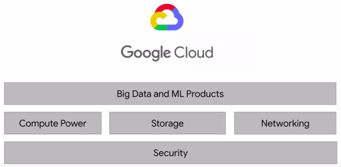

## Compute Power for Analytic and ML Workloads - 03_en


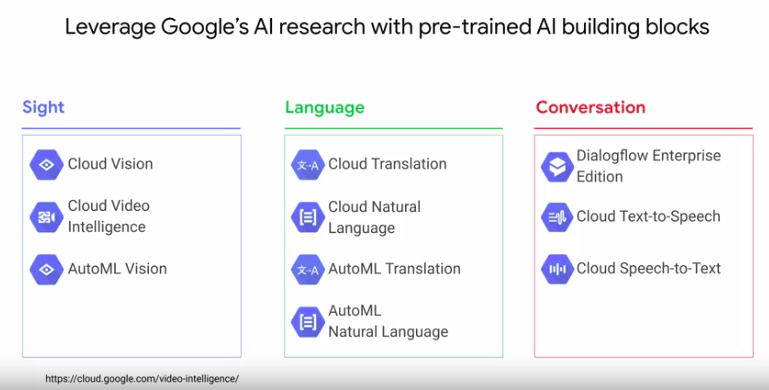

## Demo: Creating a VM on Compute Engine - 04_en

[earthquakevm](https://github.com/GoogleCloudPlatform/training-data-analyst/blob/master/courses/bdml_fundamentals/demos/earthquakevm/README.md)

## Elastic Storage with Google Cloud Storage - 05_en

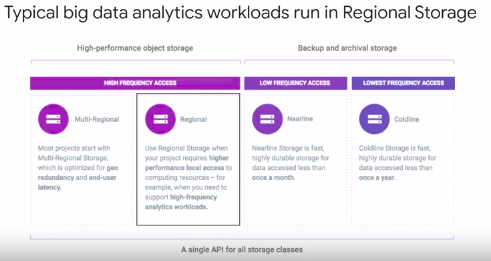

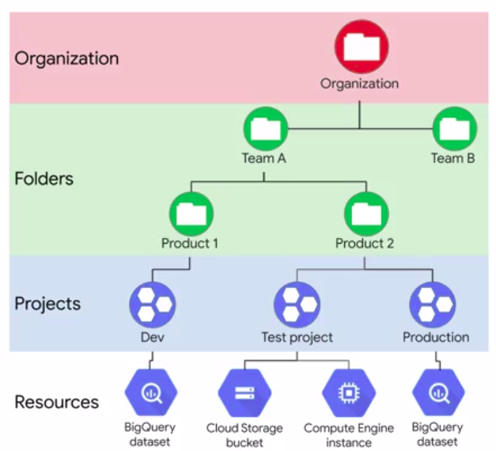

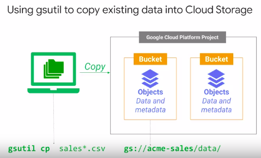

## Build on Google's Global Network - 06_en

## Security: On-premise vs Cloud-native - 07_en

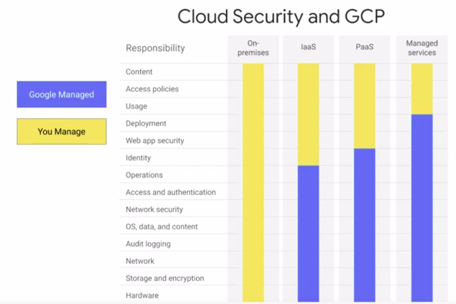

## Evolution of Google Cloud Big Data Tools - 08_en

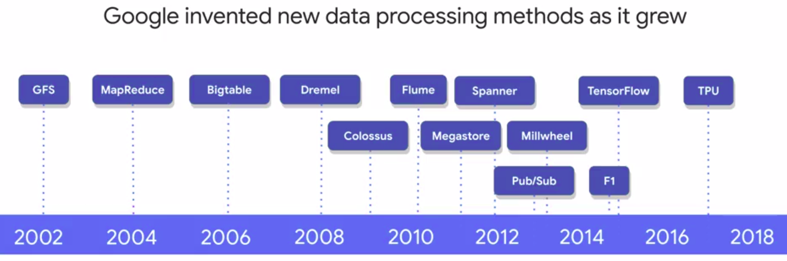

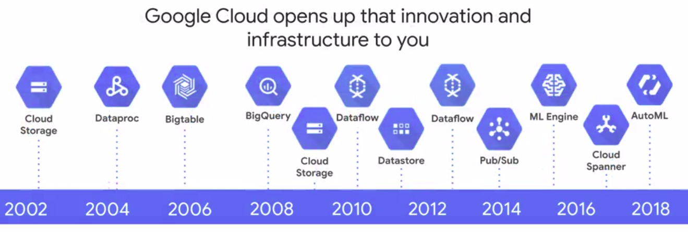


# Lab: Explore a BigQuery Public Dataset

## Google Cloud Public Datasets program

* [public_datasets_one_pager](https://services.google.com/fh/files/misc/public_datasets_one_pager.pdf)
* [BigQuery use cases](https://cloud.google.com/bigquery/#bigquery-solutions-and-use-cases)
* [Google Cloud customers who use Big Data tools](https://cloud.google.com/customers/#/products=Big_Data_Analytics)
* [Google Cloud Public Datasets](https://cloud.google.com/public-datasets/)

## Getting Started with Google Cloud Platform and Qwiklabs - 09_en


## Lab:

```sql
SELECT
  name, gender,
  SUM(number) AS total
FROM
  `bigquery-public-data.usa_names.usa_1910_2013`
GROUP BY
  name, gender
ORDER BY
  total DESC
LIMIT
  10
```

## Choosing the right approach - 10_en

### Compute

* Compute Engine
* GKE
* App Engine
* Cloud Functions

### Storage

* Cloud Bigtable
* Cloud Storage
* Cloud SQL
* Cloud Spanner
* Cloud Datastore

### Big Data

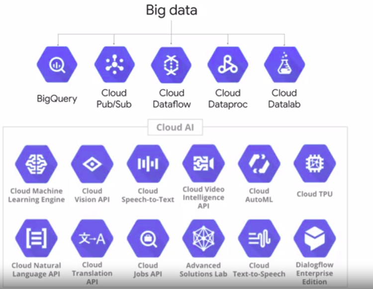
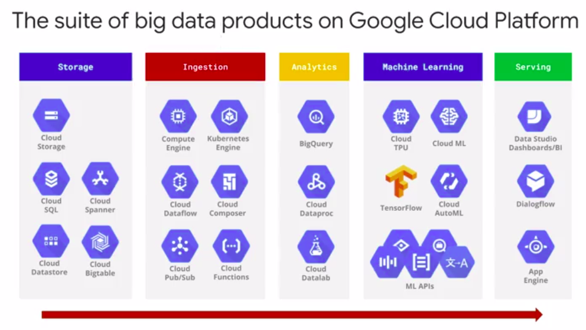

## What you can do with Google Cloud Platform - 11_en
## Activity: Explore real customer solution architectures - 12_en

[cloud.google.com/customers](https://cloud.google.com/customers/#/products=Big_Data_Analytics,Machine_Learning)

## Exploring Existing Big Data Solutions - Lab

### Exploring existing solutions

* Navigate to cloud.google.com/customers/
* Filter Products & Solutions for Big Data Analytics.
* Find an interesting customer use case

__Answer the following questions:__

* What were the key challenges to overcome?

* What tools were used in the solution and for what purpose?

* What was the impact?

## Key roles in a data-driven organization - 13_en

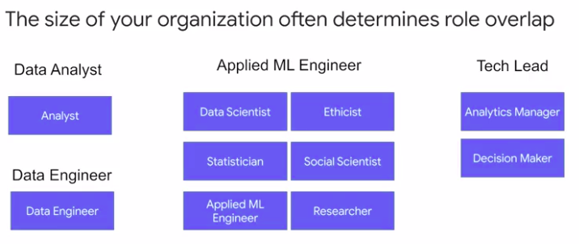


## Module Review

### What are the common big data challenges that you will be building solutions for in this course? (check all that apply)

* __Migrating existing on-premise workloads to the cloud__
* __Analyzing large datasets at scale__
* Building containerized applications for web development
* __Building streaming data pipelines__
* __Applying machine learning to your datasets__

### You have a large enterprise that will likely have many teams using their own Google Cloud Platform projects and resources. What should you be sure to have to help manage and administer these resources? (check all that apply)

* __A defined Organization__
* __Folders for teams and/or products__
* __A defined access control policy with Cloud IAM__
* A Kubernetes or Hadoop cluster for each project

### Which of the following is NOT one of the advantages of Google Cloud security

* __Google Cloud will automatically manage and curate your content and access policies to be safe for the public__
* Google Cloud will secure the physical hardware that is running your applications and infrastructure
* Google Cloud has tools like Cloud IAM that help you administer and set company-wide security policies
* Google Cloud will manage audit logging of access and use of resources in your account

### If you don't have a large dataset of your own but still want to practice writing queries and building pipelines on Google Cloud Platform, what should you do?

* __Practice with the datasets in the Google Cloud Public Datasets program__
* __Find other public datasets online and upload them into BigQuery__
* __Work to create your own dataset and then upload it into BigQuery for analysis__

### As you saw in the demo, Compute Engine nodes on GCP are:

* Expensive to create and teardown
* Pre-installed with all the software packages you might ever need.
* __Allocated on demand, and you pay for the time that they are up.__
* One of ~50 choices in terms of CPU and memory


## How businesses use recommendation systems - 14_en

## Introduction to machine learning - 15_en

* [Large-Scale Deep Learning For Building Intelligent Computer Systems](https://ai.google/research/pubs/pub44921)

* [Large-Scale Deep Learning for Intelligent Computer Systems](https://storage.googleapis.com/pub-tools-public-publication-data/pdf/44921.pdf)

* Recomentation systems require __data__, a __model__, and training/serving __infrastructure__.

## Challenge: ML for recommending housing rentals - 16_en

## Approach: Move from on-premise to Google Cloud Platform - 17_en

* On-primisse
  - Hadoop (BigData)
  - MySQL (RDBMS)

* GCP
  - DataProc
  - Cloud SQL

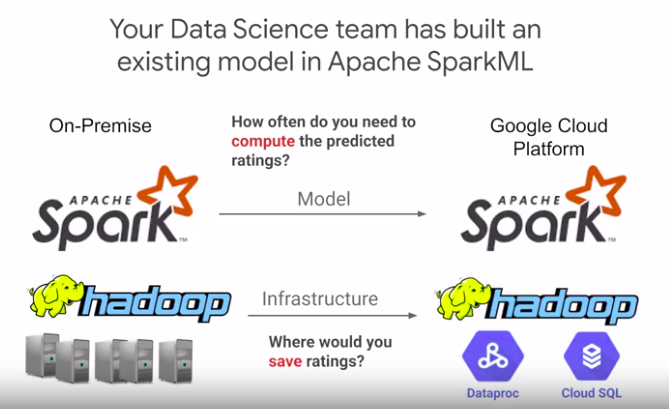

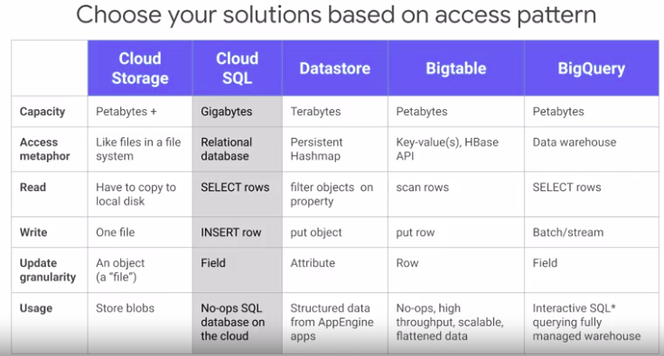

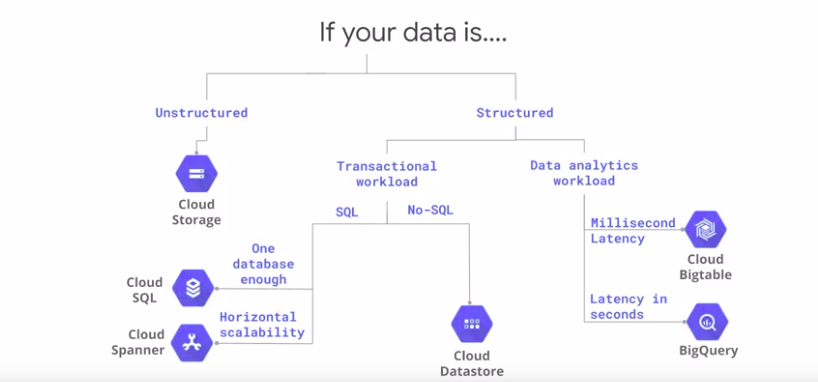