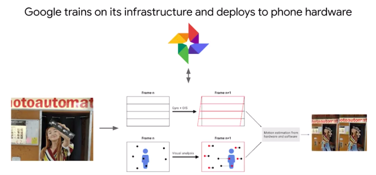
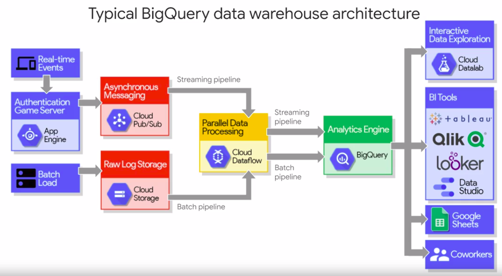

# Introduction to Google Cloud Platform - 02_en

* GCP Infrastructure
    - Compute
    - Storage
    - Networking
    - Security

* Big Data and ML products
    - Google inovation timeline
    - Choosing the right approach

* What you can do with GCP
* Activity: Explore a customer use case
* The different data roles in an organizaton


## Compute Power for Analytic and ML Workloads - 03_en




## Demo: Creating a VM on Compute Engine - 04_en

[earthquakevm](https://github.com/GoogleCloudPlatform/training-data-analyst/blob/master/courses/bdml_fundamentals/demos/earthquakevm/README.md)

## Elastic Storage with Google Cloud Storage - 05_en


## Build on Google's Global Network - 06_en

## Security: On-premise vs Cloud-native - 07_en


## Evolution of Google Cloud Big Data Tools - 08_en


# Lab: Explore a BigQuery Public Dataset

## Google Cloud Public Datasets program

* [public_datasets_one_pager](https://services.google.com/fh/files/misc/public_datasets_one_pager.pdf)
* [BigQuery use cases](https://cloud.google.com/bigquery/#bigquery-solutions-and-use-cases)
* [Google Cloud customers who use Big Data tools](https://cloud.google.com/customers/#/products=Big_Data_Analytics)
* [Google Cloud Public Datasets](https://cloud.google.com/public-datasets/)

## Getting Started with Google Cloud Platform and Qwiklabs - 09_en


## Lab:

```sql
SELECT
  name, gender,
  SUM(number) AS total
FROM
  `bigquery-public-data.usa_names.usa_1910_2013`
GROUP BY
  name, gender
ORDER BY
  total DESC
LIMIT
  10
```

## Choosing the right approach - 10_en

### Compute

* Compute Engine
* GKE
* App Engine
* Cloud Functions

### Storage

* Cloud Bigtable
* Cloud Storage
* Cloud SQL
* Cloud Spanner
* Cloud Datastore

### Big Data


## What you can do with Google Cloud Platform - 11_en
## Activity: Explore real customer solution architectures - 12_en

[cloud.google.com/customers](https://cloud.google.com/customers/#/products=Big_Data_Analytics,Machine_Learning)

## Exploring Existing Big Data Solutions - Lab

### Exploring existing solutions

* Navigate to cloud.google.com/customers/
* Filter Products & Solutions for Big Data Analytics.
* Find an interesting customer use case

__Answer the following questions:__

* What were the key challenges to overcome?

* What tools were used in the solution and for what purpose?

* What was the impact?

## Key roles in a data-driven organization - 13_en


## Module Review

### What are the common big data challenges that you will be building solutions for in this course? (check all that apply)

* __Migrating existing on-premise workloads to the cloud__
* __Analyzing large datasets at scale__
* Building containerized applications for web development
* __Building streaming data pipelines__
* __Applying machine learning to your datasets__

### You have a large enterprise that will likely have many teams using their own Google Cloud Platform projects and resources. What should you be sure to have to help manage and administer these resources? (check all that apply)

* __A defined Organization__
* __Folders for teams and/or products__
* __A defined access control policy with Cloud IAM__
* A Kubernetes or Hadoop cluster for each project

### Which of the following is NOT one of the advantages of Google Cloud security

* __Google Cloud will automatically manage and curate your content and access policies to be safe for the public__
* Google Cloud will secure the physical hardware that is running your applications and infrastructure
* Google Cloud has tools like Cloud IAM that help you administer and set company-wide security policies
* Google Cloud will manage audit logging of access and use of resources in your account

### If you don't have a large dataset of your own but still want to practice writing queries and building pipelines on Google Cloud Platform, what should you do?

* __Practice with the datasets in the Google Cloud Public Datasets program__
* __Find other public datasets online and upload them into BigQuery__
* __Work to create your own dataset and then upload it into BigQuery for analysis__

### As you saw in the demo, Compute Engine nodes on GCP are:

* Expensive to create and teardown
* Pre-installed with all the software packages you might ever need.
* __Allocated on demand, and you pay for the time that they are up.__
* One of ~50 choices in terms of CPU and memory


## How businesses use recommendation systems - 14_en

## Introduction to machine learning - 15_en

* [Large-Scale Deep Learning For Building Intelligent Computer Systems](https://ai.google/research/pubs/pub44921)

* [Large-Scale Deep Learning for Intelligent Computer Systems](https://storage.googleapis.com/pub-tools-public-publication-data/pdf/44921.pdf)

* Recomentation systems require __data__, a __model__, and training/serving __infrastructure__.

## Challenge: ML for recommending housing rentals - 16_en

## Approach: Move from on-premise to Google Cloud Platform - 17_en

* On-primisse
  - Hadoop (BigData)
  - MySQL (RDBMS)

* GCP
  - DataProc
  - Cloud SQL


## Demo: From zero to an Apache Spark job in 10 minutes or less - 18_en

## Challenge: Utilizing and tuning on-premise clusters - 19_en


## Move storage off-cluster with Google Cloud Storage - 20_en


## Lab - 21_en


## Lab: Recommend products using Cloud SQL and SparkML

* Create Cloud SQL instance
* Create database tables by importing .sql files from Cloud Storage
* Populate the tables by importing .csv files from Cloud Storage
* Allow access to Cloud SQL
* Explore the rentals data using SQL statements from CloudShell

```sql
CREATE DATABASE IF NOT EXISTS recommendation_spark;

USE recommendation_spark;

DROP TABLE IF EXISTS Recommendation;
DROP TABLE IF EXISTS Rating;
DROP TABLE IF EXISTS Accommodation;

CREATE TABLE IF NOT EXISTS Accommodation
(
  id varchar(255),
  title varchar(255),
  location varchar(255),
  price int,
  rooms int,
  rating float,
  type varchar(255),
  PRIMARY KEY (ID)
);

CREATE TABLE  IF NOT EXISTS Rating
(
  userId varchar(255),
  accoId varchar(255),
  rating int,
  PRIMARY KEY(accoId, userId),
  FOREIGN KEY (accoId) 
    REFERENCES Accommodation(id)
);

CREATE TABLE  IF NOT EXISTS Recommendation
(
  userId varchar(255),
  accoId varchar(255),
  prediction float,
  PRIMARY KEY(userId, accoId),
  FOREIGN KEY (accoId) 
    REFERENCES Accommodation(id)
);

SHOW DATABASES;
```

* connect in mysql instance
```sh
gcloud sql connect rentals --user=root --quiet
```

```sh
echo "Creating bucket: gs://$DEVSHELL_PROJECT_ID"
gsutil mb gs://$DEVSHELL_PROJECT_ID

echo "Copying data to our storage from public dataset"
gsutil cp gs://cloud-training/bdml/v2.0/data/accommodation.csv gs://$DEVSHELL_PROJECT_ID
gsutil cp gs://cloud-training/bdml/v2.0/data/rating.csv gs://$DEVSHELL_PROJECT_ID

echo "Show the files in our bucket"
gsutil ls gs://$DEVSHELL_PROJECT_ID

echo "View some sample data"
gsutil cat gs://$DEVSHELL_PROJECT_ID/accommodation.csv
```

### Generating housing recommendations with Machine Learning using Cloud Dataproc

```sh
echo "Authorizing Cloud Dataproc to connect with Cloud SQL"
CLUSTER=rentals
CLOUDSQL=rentals
ZONE=us-central1-a
NWORKERS=2

machines="$CLUSTER-m"
for w in `seq 0 $(($NWORKERS - 1))`; do
   machines="$machines $CLUSTER-w-$w"
done

echo "Machines to authorize: $machines in $ZONE ... finding their IP addresses"
ips=""
for machine in $machines; do
    IP_ADDRESS=$(gcloud compute instances describe $machine --zone=$ZONE --format='value(networkInterfaces.accessConfigs[].natIP)' | sed "s/\[u'//g" | sed "s/'\]//g" )/32
    echo "IP address of $machine is $IP_ADDRESS"
    if [ -z  $ips ]; then
       ips=$IP_ADDRESS
    else
       ips="$ips,$IP_ADDRESS"
    fi
done

echo "Authorizing [$ips] to access cloudsql=$CLOUDSQL"
gcloud sql instances patch $CLOUDSQL --authorized-networks $ips
```

* Public Ip
35.232.128.138

* Instance Connection Name:
qwiklabs-gcp-685bff2a7965b8e0:us-central1:rentals

```python
#!/usr/bin/env python
"""
Copyright Google Inc. 2016
Licensed under the Apache License, Version 2.0 (the "License");
you may not use this file except in compliance with the License.
You may obtain a copy of the License at

http://www.apache.org/licenses/LICENSE-2.0

Unless required by applicable law or agreed to in writing, software
distributed under the License is distributed on an "AS IS" BASIS,
WITHOUT WARRANTIES OR CONDITIONS OF ANY KIND, either express or implied.
See the License for the specific language governing permissions and
limitations under the License.
"""


import os
import sys
import pickle
import itertools
from math import sqrt
from operator import add
from os.path import join, isfile, dirname
from pyspark import SparkContext, SparkConf, SQLContext
from pyspark.mllib.recommendation import ALS, MatrixFactorizationModel, Rating
from pyspark.sql.types import StructType, StructField, StringType, FloatType

# MAKE EDITS HERE
CLOUDSQL_INSTANCE_IP = '35.232.128.138'   # <---- CHANGE (database server IP)
CLOUDSQL_DB_NAME = 'recommendation_spark' # <--- leave as-is
CLOUDSQL_USER = 'root'  # <--- leave as-is
CLOUDSQL_PWD  = 'XSys3S5GrwK'  # <---- CHANGE

# DO NOT MAKE EDITS BELOW
conf = SparkConf().setAppName("train_model")
sc = SparkContext(conf=conf)
sqlContext = SQLContext(sc)

jdbcDriver = 'com.mysql.jdbc.Driver'
jdbcUrl    = 'jdbc:mysql://%s:3306/%s?user=%s&password=%s' % (CLOUDSQL_INSTANCE_IP, CLOUDSQL_DB_NAME, CLOUDSQL_USER, CLOUDSQL_PWD)

# checkpointing helps prevent stack overflow errors
sc.setCheckpointDir('checkpoint/')

# Read the ratings and accommodations data from Cloud SQL
dfRates = sqlContext.read.format('jdbc').options(driver=jdbcDriver, url=jdbcUrl, dbtable='Rating', useSSL='false').load()
dfAccos = sqlContext.read.format('jdbc').options(driver=jdbcDriver, url=jdbcUrl, dbtable='Accommodation', useSSL='false').load()
print("read ...")

# train the model
model = ALS.train(dfRates.rdd, 20, 20) # you could tune these numbers, but these are reasonable choices
print("trained ...")

# use this model to predict what the user would rate accommodations that she has not rated
allPredictions = None
for USER_ID in range(0, 100):
  dfUserRatings = dfRates.filter(dfRates.userId == USER_ID).rdd.map(lambda r: r.accoId).collect()
  rddPotential  = dfAccos.rdd.filter(lambda x: x[0] not in dfUserRatings)
  pairsPotential = rddPotential.map(lambda x: (USER_ID, x[0]))
  predictions = model.predictAll(pairsPotential).map(lambda p: (str(p[0]), str(p[1]), float(p[2])))
  predictions = predictions.takeOrdered(5, key=lambda x: -x[2]) # top 5
  print("predicted for user={0}".format(USER_ID))
  if (allPredictions == None):
    allPredictions = predictions
  else:
    allPredictions.extend(predictions)

# write them
schema = StructType([StructField("userId", StringType(), True), StructField("accoId", StringType(), True), StructField("prediction", FloatType(), True)])
dfToSave = sqlContext.createDataFrame(allPredictions, schema)
dfToSave.write.jdbc(url=jdbcUrl, table='Recommendation', mode='overwrite')
```

## Module Review

### Complete the following: You should feed your machine learning model your _______ and not your _______. It will learn those for itself!

* if/then statements, data
* rules, data
* __data, rules__

### True or False: Cloud SQL is a big data analytics warehouse

* True
* __False__

### True or False: If you are migrating your Hadoop workload to the cloud, you must first rewrite all your Spark jobs to be compliant with the cloud.

* True
* __False__


### You are thinking about migrating your Hadoop workloads to the cloud and you have a few workloads that are fault-tolerant (they can handle interruptions of individual VMs gracefully). What are some architecture considerations you should explore in the cloud? Choose all that apply


* __Use PVMs or Preemptible Virtual Machines__
* __Migrate your storage from on-cluster HDFS to off-cluster Google Cloud Storage (GCS)__
* __Consider having multiple Cloud Dataproc instances for each priority workload and then turning them down when not in use__

### Google Cloud Storage is a good option for storing data that: (Select the 2 correct options below).

* Is ingested in real-time from sensors and other devices and supports SQL-based queries
* __May be imported from a bucket into a Hadoop cluster for analysis__
* __May be required to be read at some later time (i.e. load a CSV file into BigQuery)__
* Will be accessed frequently and updated constantly with new transactions from a front-end and needs to be stored in a relational database

### Relational databases are a good choice when you need:

* __Transactional updates on relatively small datasets__
* Fast queries on terabytes of data
* Streaming, high-throughput writes
* Aggregations on unstructured data

### Cloud SQL and Cloud Dataproc offer familiar tools (MySQL and Hadoop/Pig/Hive/Spark). What is the value-add provided by Google Cloud Platform? (Select the 2 correct options below )

* __Fully-managed versions of the software offer no-ops__
* __Running it on Google infrastructure offers reliability and cost savings__
* Google-proprietary extensions and bug fixes to MySQL, Hadoop, and so on
* It’s the same API, but Google implements it better

* [Migrating Hadoop to Google Cloud Platform](https://cloud.google.com/solutions/migration/hadoop/hadoop-gcp-migration-overview)

## Introduction to BigQuery - 22_en

### BigQuery is a petabyte-scale fully-managed data warehouse

1. It's serverless
2. Flexible pricing model
3. Data encryption and security
4. Geospatial data types & functions
5. Foundation for BI and AI



## Demo: Query 2 billion lines of Github code in less than 30 seconds- 23_en

[Demo](https://github.com/GoogleCloudPlatform/training-data-analyst/blob/master/courses/bdml_fundamentals/demos/bigquery-analyze-github.sql)


## BigQuery: Fast SQL Engine - 24_en

### BigQuery is two services in one

* Fast SQL Query Engine 
* Managed storage for datasets

## Demo: Exploring bike share data with SQL - 25_en

## Data quality - 26_en

## BigQuery managed storage - 27_en


## Insights from geographic data - 28_en

## Demo: Analyzing lightning strikes with BigQuery GIS - 29_en

[Datasets Marketplace](https://console.cloud.google.com/marketplace/browse?filter=solution-type:dataset)

## Choosing a ML model type for structured data - 30_en


## Predicting customer lifetime value - 31_en

## BigQueryML: Create models with SQL - 32_en


## Phases in ML model lifecycle - 33_en


## BigQuery ML: key features walkthrough - 34_en


## Lab: Predict Visitor Purchases with a Classification Model with BigQuery ML

* Use BigQuery to find public datasets
* Query and explore the ecommerce dataset
* Create a training and evaluation dataset to be used for batch prediction
* Create a classification (logistic regression) model in BQML
* Evaluate the performance of your machine learning model
* Predict and rank the probability that a visitor will make a purchase

[](https://console.cloud.google.com/bigquery?p=data-to-insights&d=ecommerce&t=web_analytics&page=table)

```sql
#standardSQL
WITH visitors AS(
SELECT
COUNT(DISTINCT fullVisitorId) AS total_visitors
FROM `data-to-insights.ecommerce.web_analytics`
),

purchasers AS(
SELECT
COUNT(DISTINCT fullVisitorId) AS total_purchasers
FROM `data-to-insights.ecommerce.web_analytics`
WHERE totals.transactions IS NOT NULL
)

SELECT
  total_visitors,
  total_purchasers,
  total_purchasers / total_visitors AS conversion_rate
FROM visitors, purchasers
```

```json
[
  {
    "total_visitors": "741721",
    "total_purchasers": "20015",
    "conversion_rate": "0.026984540008979117"
  }
]
```

```sql
SELECT
  p.v2ProductName,
  p.v2ProductCategory,
  SUM(p.productQuantity) AS units_sold,
  ROUND(SUM(p.localProductRevenue/1000000),2) AS revenue
FROM `data-to-insights.ecommerce.web_analytics`,
UNNEST(hits) AS h,
UNNEST(h.product) AS p
GROUP BY 1, 2
ORDER BY revenue DESC
LIMIT 5;
```

```json
[
  {
    "v2ProductName": "Nest® Learning Thermostat 3rd Gen-USA - Stainless Steel",
    "v2ProductCategory": "Nest-USA",
    "units_sold": "17651",
    "revenue": "870976.95"
  },
  {
    "v2ProductName": "Nest® Cam Outdoor Security Camera - USA",
    "v2ProductCategory": "Nest-USA",
    "units_sold": "16930",
    "revenue": "684034.55"
  },
  {
    "v2ProductName": "Nest® Cam Indoor Security Camera - USA",
    "v2ProductCategory": "Nest-USA",
    "units_sold": "14155",
    "revenue": "548104.47"
  },
  {
    "v2ProductName": "Nest® Protect Smoke + CO White Wired Alarm-USA",
    "v2ProductCategory": "Nest-USA",
    "units_sold": "6394",
    "revenue": "178937.6"
  },
  {
    "v2ProductName": "Nest® Protect Smoke + CO White Battery Alarm-USA",
    "v2ProductCategory": "Nest-USA",
    "units_sold": "6340",
    "revenue": "178572.4"
  }
]
```


```sql
# visitors who bought on a return visit (could have bought on first as well
WITH all_visitor_stats AS (
SELECT
  fullvisitorid, # 741,721 unique visitors
  IF(COUNTIF(totals.transactions > 0 AND totals.newVisits IS NULL) > 0, 1, 0) AS will_buy_on_return_visit
  FROM `data-to-insights.ecommerce.web_analytics`
  GROUP BY fullvisitorid
)

SELECT
  COUNT(DISTINCT fullvisitorid) AS total_visitors,
  will_buy_on_return_visit
FROM all_visitor_stats
GROUP BY will_buy_on_return_visit
```

```json
[
  {
    "total_visitors": "729848",
    "will_buy_on_return_visit": "0"
  },
  {
    "total_visitors": "11873",
    "will_buy_on_return_visit": "1"
  }
]
```

```sql
SELECT
  * EXCEPT(fullVisitorId)
FROM

  # features
  (SELECT
    fullVisitorId,
    IFNULL(totals.bounces, 0) AS bounces,
    IFNULL(totals.timeOnSite, 0) AS time_on_site
  FROM
    `data-to-insights.ecommerce.web_analytics`
  WHERE
    totals.newVisits = 1)
  JOIN
  (SELECT
    fullvisitorid,
    IF(COUNTIF(totals.transactions > 0 AND totals.newVisits IS NULL) > 0, 1, 0) AS will_buy_on_return_visit
  FROM
      `data-to-insights.ecommerce.web_analytics`
  GROUP BY fullvisitorid)
  USING (fullVisitorId)
ORDER BY time_on_site DESC
LIMIT 10;
```

```json
[
  {
    "bounces": "0",
    "time_on_site": "15047",
    "will_buy_on_return_visit": "0"
  },
  {
    "bounces": "0",
    "time_on_site": "12136",
    "will_buy_on_return_visit": "0"
  },
  {
    "bounces": "0",
    "time_on_site": "11201",
    "will_buy_on_return_visit": "0"
  },
  {
    "bounces": "0",
    "time_on_site": "10046",
    "will_buy_on_return_visit": "0"
  },
  {
    "bounces": "0",
    "time_on_site": "9974",
    "will_buy_on_return_visit": "0"
  }
]
```

```sql
CREATE OR REPLACE MODEL `ecommerce.classification_model`
OPTIONS
(
model_type='logistic_reg',
labels = ['will_buy_on_return_visit']
)
AS

#standardSQL
SELECT
  * EXCEPT(fullVisitorId)
FROM

  # features
  (SELECT
    fullVisitorId,
    IFNULL(totals.bounces, 0) AS bounces,
    IFNULL(totals.timeOnSite, 0) AS time_on_site
  FROM
    `data-to-insights.ecommerce.web_analytics`
  WHERE
    totals.newVisits = 1
    AND date BETWEEN '20160801' AND '20170430') # train on first 9 months
  JOIN
  (SELECT
    fullvisitorid,
    IF(COUNTIF(totals.transactions > 0 AND totals.newVisits IS NULL) > 0, 1, 0) AS will_buy_on_return_visit
  FROM
      `data-to-insights.ecommerce.web_analytics`
  GROUP BY fullvisitorid)
  USING (fullVisitorId)
;
```

```sql
SELECT
  roc_auc,
  CASE
    WHEN roc_auc > .9 THEN 'good'
    WHEN roc_auc > .8 THEN 'fair'
    WHEN roc_auc > .7 THEN 'not great'
  ELSE 'poor' END AS model_quality
FROM
  ML.EVALUATE(MODEL ecommerce.classification_model,  (

SELECT
  * EXCEPT(fullVisitorId)
FROM

  # features
  (SELECT
    fullVisitorId,
    IFNULL(totals.bounces, 0) AS bounces,
    IFNULL(totals.timeOnSite, 0) AS time_on_site
  FROM
    `data-to-insights.ecommerce.web_analytics`
  WHERE
    totals.newVisits = 1
    AND date BETWEEN '20170501' AND '20170630') # eval on 2 months
  JOIN
  (SELECT
    fullvisitorid,
    IF(COUNTIF(totals.transactions > 0 AND totals.newVisits IS NULL) > 0, 1, 0) AS will_buy_on_return_visit
  FROM
      `data-to-insights.ecommerce.web_analytics`
  GROUP BY fullvisitorid)
  USING (fullVisitorId)

));
```

```json
[
  {
    "roc_auc": "0.724588",
    "model_quality": "not great"
  }
]
```

```sql
CREATE OR REPLACE MODEL `ecommerce.classification_model_2`
OPTIONS
  (model_type='logistic_reg', labels = ['will_buy_on_return_visit']) AS

WITH all_visitor_stats AS (
SELECT
  fullvisitorid,
  IF(COUNTIF(totals.transactions > 0 AND totals.newVisits IS NULL) > 0, 1, 0) AS will_buy_on_return_visit
  FROM `data-to-insights.ecommerce.web_analytics`
  GROUP BY fullvisitorid
)

# add in new features
SELECT * EXCEPT(unique_session_id) FROM (

  SELECT
      CONCAT(fullvisitorid, CAST(visitId AS STRING)) AS unique_session_id,

      # labels
      will_buy_on_return_visit,

      MAX(CAST(h.eCommerceAction.action_type AS INT64)) AS latest_ecommerce_progress,

      # behavior on the site
      IFNULL(totals.bounces, 0) AS bounces,
      IFNULL(totals.timeOnSite, 0) AS time_on_site,
      totals.pageviews,

      # where the visitor came from
      trafficSource.source,
      trafficSource.medium,
      channelGrouping,

      # mobile or desktop
      device.deviceCategory,

      # geographic
      IFNULL(geoNetwork.country, "") AS country

  FROM `data-to-insights.ecommerce.web_analytics`,
     UNNEST(hits) AS h

    JOIN all_visitor_stats USING(fullvisitorid)

  WHERE 1=1
    # only predict for new visits
    AND totals.newVisits = 1
    AND date BETWEEN '20160801' AND '20170430' # train 9 months

  GROUP BY
  unique_session_id,
  will_buy_on_return_visit,
  bounces,
  time_on_site,
  totals.pageviews,
  trafficSource.source,
  trafficSource.medium,
  channelGrouping,
  device.deviceCategory,
  country
);
```

```sql
#standardSQL
SELECT
  roc_auc,
  CASE
    WHEN roc_auc > .9 THEN 'good'
    WHEN roc_auc > .8 THEN 'fair'
    WHEN roc_auc > .7 THEN 'not great'
  ELSE 'poor' END AS model_quality
FROM
  ML.EVALUATE(MODEL ecommerce.classification_model_2,  (

WITH all_visitor_stats AS (
SELECT
  fullvisitorid,
  IF(COUNTIF(totals.transactions > 0 AND totals.newVisits IS NULL) > 0, 1, 0) AS will_buy_on_return_visit
  FROM `data-to-insights.ecommerce.web_analytics`
  GROUP BY fullvisitorid
)

# add in new features
SELECT * EXCEPT(unique_session_id) FROM (

  SELECT
      CONCAT(fullvisitorid, CAST(visitId AS STRING)) AS unique_session_id,

      # labels
      will_buy_on_return_visit,

      MAX(CAST(h.eCommerceAction.action_type AS INT64)) AS latest_ecommerce_progress,

      # behavior on the site
      IFNULL(totals.bounces, 0) AS bounces,
      IFNULL(totals.timeOnSite, 0) AS time_on_site,
      totals.pageviews,

      # where the visitor came from
      trafficSource.source,
      trafficSource.medium,
      channelGrouping,

      # mobile or desktop
      device.deviceCategory,

      # geographic
      IFNULL(geoNetwork.country, "") AS country

  FROM `data-to-insights.ecommerce.web_analytics`,
     UNNEST(hits) AS h

    JOIN all_visitor_stats USING(fullvisitorid)

  WHERE 1=1
    # only predict for new visits
    AND totals.newVisits = 1
    AND date BETWEEN '20170501' AND '20170630' # eval 2 months

  GROUP BY
  unique_session_id,
  will_buy_on_return_visit,
  bounces,
  time_on_site,
  totals.pageviews,
  trafficSource.source,
  trafficSource.medium,
  channelGrouping,
  device.deviceCategory,
  country
)
));
```

```json
[
  {
    "roc_auc": "0.910397",
    "model_quality": "good"
  }
]
```

```sql
SELECT
*
FROM
  ml.PREDICT(MODEL `ecommerce.classification_model_2`,
   (

WITH all_visitor_stats AS (
SELECT
  fullvisitorid,
  IF(COUNTIF(totals.transactions > 0 AND totals.newVisits IS NULL) > 0, 1, 0) AS will_buy_on_return_visit
  FROM `data-to-insights.ecommerce.web_analytics`
  GROUP BY fullvisitorid
)

  SELECT
      CONCAT(fullvisitorid, '-',CAST(visitId AS STRING)) AS unique_session_id,

      # labels
      will_buy_on_return_visit,

      MAX(CAST(h.eCommerceAction.action_type AS INT64)) AS latest_ecommerce_progress,

      # behavior on the site
      IFNULL(totals.bounces, 0) AS bounces,
      IFNULL(totals.timeOnSite, 0) AS time_on_site,
      totals.pageviews,

      # where the visitor came from
      trafficSource.source,
      trafficSource.medium,
      channelGrouping,

      # mobile or desktop
      device.deviceCategory,

      # geographic
      IFNULL(geoNetwork.country, "") AS country

  FROM `data-to-insights.ecommerce.web_analytics`,
     UNNEST(hits) AS h

    JOIN all_visitor_stats USING(fullvisitorid)

  WHERE
    # only predict for new visits
    totals.newVisits = 1
    AND date BETWEEN '20170701' AND '20170801' # test 1 month

  GROUP BY
  unique_session_id,
  will_buy_on_return_visit,
  bounces,
  time_on_site,
  totals.pageviews,
  trafficSource.source,
  trafficSource.medium,
  channelGrouping,
  device.deviceCategory,
  country
)

)

ORDER BY
  predicted_will_buy_on_return_visit DESC;
```

```json
[
  {
    "predicted_will_buy_on_return_visit": "1",
    "predicted_will_buy_on_return_visit_probs": [
      {
        "label": "1",
        "prob": "0.5226488220858005"
      },
      {
        "label": "0",
        "prob": "0.47735117791419945"
      }
    ],
    "unique_session_id": "7334489755042666687-1499350997",
    "will_buy_on_return_visit": "0",
    "latest_ecommerce_progress": "6",
    "bounces": "0",
    "time_on_site": "599",
    "pageviews": "11",
    "source": "gdeals.googleplex.com",
    "medium": "referral",
    "channelGrouping": "Referral",
    "deviceCategory": "desktop",
    "country": "United States"
  }
]
```

## Module Review

### Which of the below are the core services that make up BigQuery? (choose the correct 2)

* __Query service__
* __Storage service__
* Data Optimization service
* Machine Learning service

### You want to know how many rows are in the BigQuery Public Dataset on San Francisco Bike Shares. What could you do?


* Run the below query:
```sql
SELECT

 SUM(*) AS total_trips

FROM

 `bigquery-public-data.san_francisco_bikeshare.bikeshare_trips`
```

* __Run the below query:__

```sql
SELECT

 COUNT(*) AS total_trips

FROM

 `bigquery-public-data.san_francisco_bikeshare.bikeshare_trips`
```

* __In the BigQuery Web UI, find the table and click the details tab and view the rows.__

### True or False: You can query a Google Spreadsheet directly from BigQuery without loading it in first.

* __True__
* False

### You have a taxi service data schema that has three columns:

- ride_id
- ride_timestamp
- ride_status
  You want to use BigQuery for reporting but you don't want to split your table into multiple sub-tables. What native features of BigQuery data types should you explore? (check all that apply)


* Consider renaming the ride_id column to 'label' so you can use it in a BigQuery ML model to predict the ride_id of the next ride.


* __Consider adding lat / long geographic data points as new columns and using GIS Functions to quickly plot the distances your fleet has travelled.__


* __Consider making ride_timestamp an ARRAY of timestamp values so each ride_id row in your table could still be unique and easy to report off of.__

### Complete the following: In ML, a row of data is called a(n) ________ and a column of data is called a(n) _______. We mark one or more columns as ________ which we know for historical data and are trying to predict for future data.


* labels
* instance or observation
* labels

* instance or observation
* labels
* feature

* __instance or observation__
* __feature__
* __labels__
