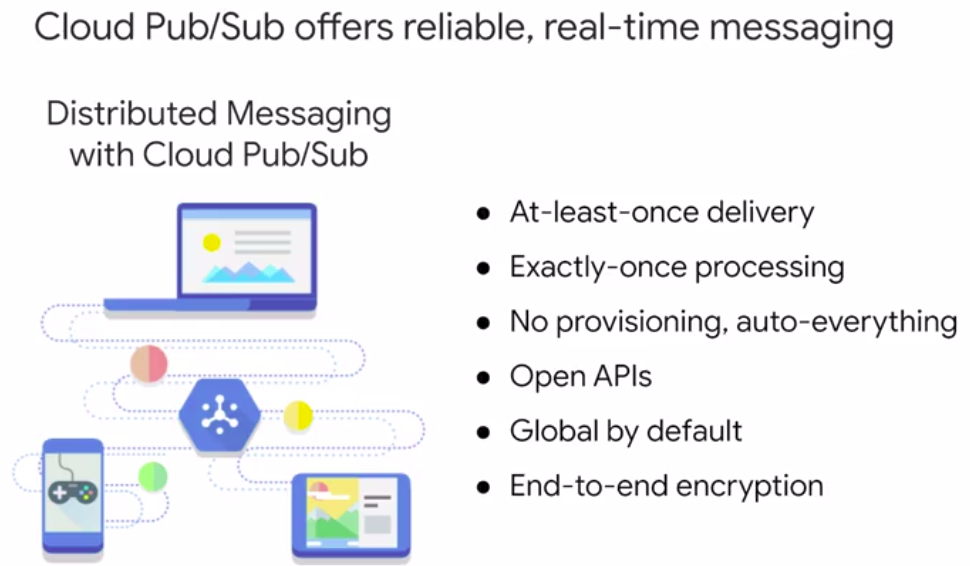
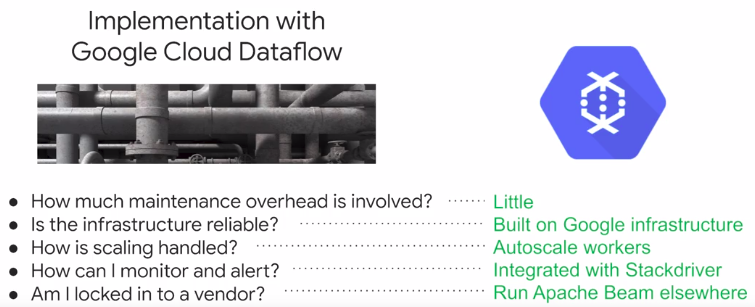
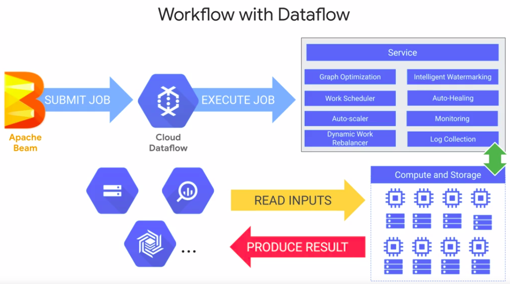

## Modern data pipeline challenges - 01_en

## Message-oriented architectures with Cloud Pub/Sub - 02_en

### IoT devices present new challenges to data ingestion

* Data streaming from varios processes or devices
* Distruting event notifications (ex: new user sign up)
* Scale to handle volume
* Reliabe(no duplicates)




## Designing streaming pipelines with Apache Beam - 03_en

* [Apache Beam](https://beam.apache.org/get-started/beam-overview/) is an open source, unified model for defining both batch and streaming data-parallel processing pipelines. Using one of the open source Beam SDKs, you build a program that defines the pipeline. The pipeline is then executed by one of Beam’s supported __distributed processing back-ends__, which include Apache Apex, Apache Flink, Apache Spark, and Google Cloud Dataflow.


## Implementing streaming pipelines on Cloud Dataflow - 04_en





* [Dataflow templates](https://cloud.google.com/dataflow/docs/guides/templates/provided-templates)

## Visualizing insights with Data Studio - 05_en

## Creating charts with Data Studio - 06_en

## Demo: Data Studio walkthrough - 07_en

## Lab: Create a Streaming Data Pipeline for a Real-Time Dashboard with Cloud Dataflow

*   Connect to a streaming data Topic in Cloud Pub/sub
*   Ingest streaming data with Cloud Dataflow
*   Load streaming data into BigQuery
*   Analyze and visualize the results

```sh
bq mk taxirides
```

```sh
bq mk \
--time_partitioning_field timestamp \
--schema ride_id:string,point_idx:integer,latitude:float,longitude:float,\
timestamp:timestamp,meter_reading:float,meter_increment:float,ride_status:string,\
passenger_count:integer -t taxirides.realtime
```

## Module Review

### Relational databases are a good choice when you need:

* Streaming, high-throughput writes
* Fast queries on terabytes of data
* Aggregations on unstructured data
* __Transactional updates on relatively small datasets__

### Cloud SQL and Cloud Dataproc offer familiar tools (MySQL and Hadoop/Pig/Hive/Spark). What is the value-add provided by Google Cloud Platform? (Select all of the correct options)

* It’s the same API, but Google implements it better
* Google-proprietary extensions and bug fixes to MySQL, Hadoop, and so on
* Fully-managed versions of the software offer no-ops
* Running it on Google infrastructure offers reliability and cost savings

## Where is unstructured ML used in business? - 08_en

[movemirror](g.co/movemirror)

## How does ML on unstructured data work? - 09_en

## Comparing approaches to ML - 10_en

[cloud.google/vision](cloud.google/vision)
[cloud.google/translate](cloud.google/translate)
[cloud.google/speech](cloud.google/speech)
[cloud.google/video_inteligence](cloud.google/video_inteligence)

## Using pre-built AI to create a chatbot - 11_en