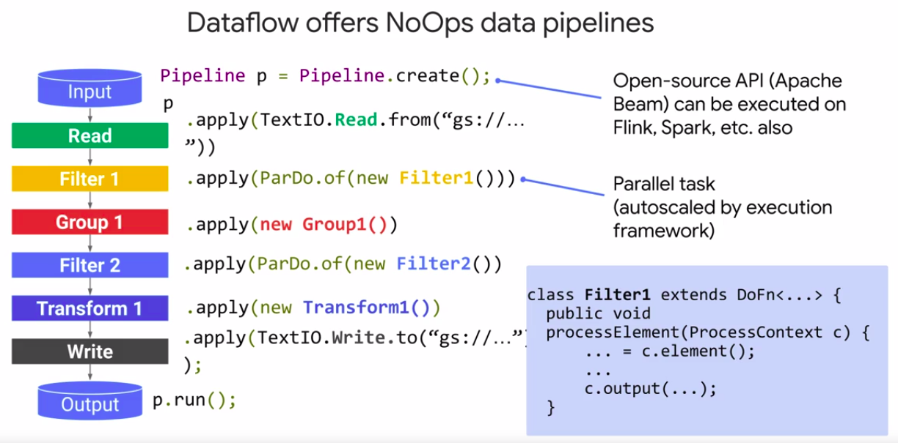

## Modern data pipeline challenges - 01_en

## Message-oriented architectures with Cloud Pub/Sub - 02_en

### IoT devices present new challenges to data ingestion

* Data streaming from varios processes or devices
* Distruting event notifications (ex: new user sign up)
* Scale to handle volume
* Reliabe(no duplicates)

## Designing streaming pipelines with Apache Beam - 03_en

* [Apache Beam](https://beam.apache.org/get-started/beam-overview/) is an open source, unified model for defining both batch and streaming data-parallel processing pipelines. Using one of the open source Beam SDKs, you build a program that defines the pipeline. The pipeline is then executed by one of Beam’s supported __distributed processing back-ends__, which include Apache Apex, Apache Flink, Apache Spark, and Google Cloud Dataflow.

## Implementing streaming pipelines on Cloud Dataflow - 04_en

* [Dataflow templates](https://cloud.google.com/dataflow/docs/guides/templates/provided-templates)

## Visualizing insights with Data Studio - 05_en

## Creating charts with Data Studio - 06_en

## Demo: Data Studio walkthrough - 07_en